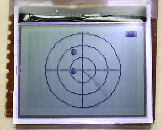

# RisibleRadar #

Radar-based game for the Arduino using a Nokia 1202 LCD and an analog joystick.
Originally written in May 2012 for Ludum Dare MiniLD \#34: Resolution.
The connection to the theme is that the playing area is circular.

## Screenshot ##

